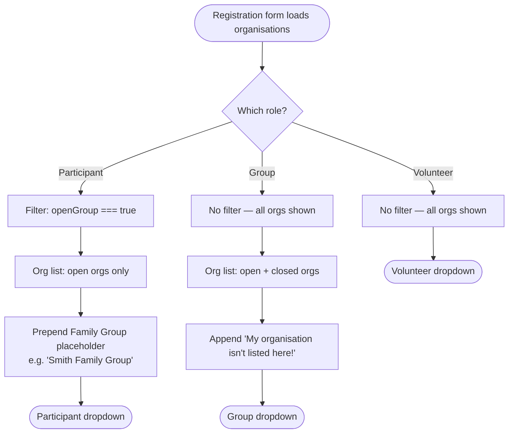

# Organisation Open/Closed Group Design

**Date:** 2026-03-24
**Status:** Approved

## Summary

Replace the legacy `groupType`-based organisation filtering in the registration form with a simpler binary `openGroup` flag on the `organisations` table. This makes the filtering model explicit, admin-configurable, and decoupled from the Airtable-derived group type classification.

## Context

The existing `groupType` field (7 categories: Family, Disability, Corporate, Sporting, Community, Educational, Other) was inherited from Airtable and used to determine which organisations appear in each registration role's dropdown. The categories are confusing to both the development team and the client. The underlying concept is simpler: a group is either open to individual participants or restricted to group leaders only.

## Conceptual Model

A group (organisation) is either **open** or **closed**:

- **Open group** — participants can register individually against this organisation. Visible to both Participant and Group role registrants.
- **Closed group** — only a group leader registers on behalf of all members. Visible to Group role registrants only.

This classification is an admin concept only. End users on the registration form have no awareness of open/closed — they simply see the organisations relevant to their role.

## Truth Table

| `openGroup` value | Participant role dropdown | Group role dropdown |
|---|---|---|
| `true` (open) | visible | visible |
| `false` (closed) | hidden | visible |

The Group role dropdown intentionally shows all organisations (both open and closed). This is correct: a group leader may lead either an open or a closed group.

### Special cases (unchanged)

| Item | Participant role | Group role |
|---|---|---|
| Family Group placeholder | always visible (pinned at top) | never shown |
| "My organisation isn't listed here!" escape option | never shown | always visible (pinned at bottom) |

The Family Group placeholder is a hardcoded UI element with value `FAMILY_GROUP_PLACEHOLDER`. It is not a database record and has no `openGroup` field. It is always shown to Participant role registrants regardless of any organisation's `openGroup` value (including the `role === undefined` case, which is also unchanged). Its behaviour — including dynamic surname personalisation — does not change.

## Schema Change

Add `openGroup: boolean` to the `organisations` table:

- **Type:** boolean, not nullable
- **Default:** `true` (open)
- **Location:** `organisations` table only — not `organisationContacts`

The column is added via `npm run db:push`. All records default to `true`. The `openGroup` flag is then set per organisation through the P2I admin CRUD pages going forward.

### `findOrCreateFamilyGroup` in `db-service.ts`

The `findOrCreateFamilyGroup` method hard-codes `groupType: 'Family'` when creating a Family Group org record. This method must also set `openGroup: false`, as Family groups are always closed.

## Filtering Flow Diagram



## Filtering Logic Change

**File:** `lib/helpers.ts` — `organizationsToOptions()`

Current behaviour (to be replaced):

```
Participant     → filter to orgs where groupType NOT IN ['Disability', 'Family']
Group           → filter to orgs where groupType IN ['Disability', 'Family']
Volunteer       → no filter
role undefined  → no filter (Family Group placeholder shown)
```

New behaviour:

```
Participant     → filter to orgs where openGroup === true
Group           → no filter (all orgs shown — open and closed)
Volunteer       → no filter (unchanged)
role undefined  → no filter (unchanged; Family Group placeholder still shown)
```

The `DISABILITY_FAMILY_TYPES` constant is removed. The `openGroup` field replaces it as the filtering criterion. The `role === undefined` path is unchanged.

## What Does Not Change

The following areas continue to use `groupType` and are intentionally out of scope for this change. The `groupType` field remains in the schema and continues to be read/written as before.

- **Form field labels and UI copy** — no changes to registration form text
- **`shouldShowImpairmentFields`** in `registration-form.tsx` — continues to check `groupType === 'Disability' || groupType === 'Family'` to conditionally show impairment/disability fields
- **`lib/participant-counting.ts`** — `isExpectedOnlyGroupType()` continues to use `groupType` to determine counting method. `openGroup` does not affect participant counting.
- **`/admin/event/organizations/[organizationId]` page** — display logic based on `groupType` is unchanged
- **Airtable sync** — reads and writes `groupType` as before
- **Volunteer role filtering** — no filter applied (unchanged)
- **`organisationContacts` table** — `openGroup` is on `organisations` only
- **Family Group placeholder behaviour** — including dynamic surname personalisation and `role === undefined` path

## Admin Configuration

The `openGroup` flag is set per organisation via the P2I admin organisation CRUD pages. These pages are being built as separate work (see `docs/superpowers/plans/2026-03-23-p2i-crud-admin.md`). **The `openGroup` boolean toggle must be added to the `adminOrgFormSchema` and to the org create/edit form UI in that plan — it is currently absent from the plan and must be added before implementation begins.** Until those pages exist, `openGroup` can be managed directly via Drizzle Studio.

## Affected Files

| File | Change |
|---|---|
| `lib/db/schema.ts` | Add `openGroup` boolean column (not null, default true) to `organisations` table |
| `lib/types.ts` | Add `openGroup: boolean` (required, not optional) to `Organization` interface |
| `lib/helpers.ts` | Replace `DISABILITY_FAMILY_TYPES` check with `openGroup` check in `organizationsToOptions()` |
| `lib/db-service.ts` — `getOrganizations()` | Include `openGroup` in the SELECT |
| `lib/db-service.ts` — `createOrganization()` | Accept and write `openGroup` field |
| `lib/db-service.ts` — `updateOrganization()` | Accept and write `openGroup` field |
| `lib/db-service.ts` — `findOrCreateFamilyGroup()` | Set `openGroup: false` when creating a Family Group record |
| `docs/superpowers/plans/2026-03-23-p2i-crud-admin.md` | Add `openGroup` to `adminOrgFormSchema` and org create/edit form JSX |
| P2I admin org CRUD pages (planned) | Add `openGroup` boolean toggle to org create and edit forms |
