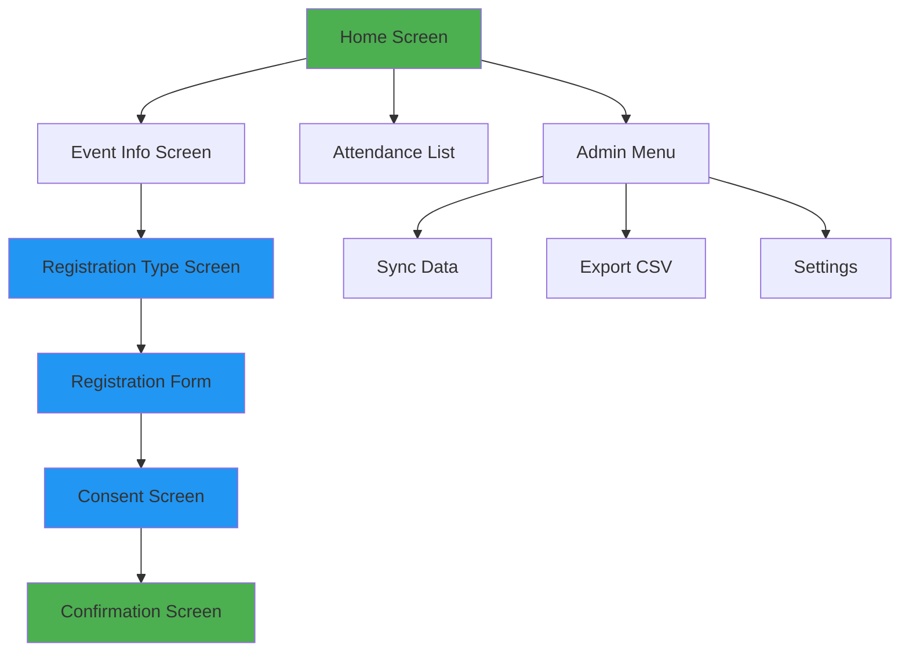

# UI Wireframes V2 - Based on Existing Form

**Version:** 2.0  
**Date:** 2026-02-11  
**Status:** Updated based on existing Airtable form feedback  
**Previous Version:** [UI_WIREFRAMES.md](./UI_WIREFRAMES.md)

---

## Overview

This version of the wireframes is based on the **existing PowerHouseGames volunteer signup form** with approved enhancements. The design maintains the simplicity of the current form while adding essential fields (Organization, Impairment) and supporting both Attendees and Volunteers.

### Key Changes from V1
- ✅ Event selection via dropdown (pre-selected to current event)
- ✅ Radio buttons for consents (not checkboxes)
- ✅ "Orange wristband" language preserved
- ✅ Organization field added (required)
- ✅ "Do you have an impairment" field added (renamed from Accessibility Needs)
- ❌ Phone number removed (not needed)
- ✅ Same form for Attendee/Volunteer with conditional fields

---

## User Flow Diagram



---

## Screen Designs

### 1. Home Screen

```
┌─────────────────────────────────────┐
│  Power2Inspire Event CRM            │
│                                     │
│  ┌───────────────────────────────┐ │
│  │                               │ │
│  │      [Event Icon]             │ │
│  │                               │ │
│  │   Current Event:              │ │
│  │   PowerHouseGames 2026        │ │
│  │   Date: 15 March 2026         │ │
│  │                               │ │
│  └───────────────────────────────┘ │
│                                     │
│  ┌─────────────────────────────┐   │
│  │   📝 NEW REGISTRATION       │   │
│  └─────────────────────────────┘   │
│                                     │
│  ┌─────────────────────────────┐   │
│  │   ✓ ATTENDANCE LIST         │   │
│  └─────────────────────────────┘   │
│                                     │
│  ┌─────────────────────────────┐   │
│  │   ⚙️ ADMIN                  │   │
│  └─────────────────────────────┘   │
│                                     │
└─────────────────────────────────────┘
```

**Elements:**
- Event info card (read-only, shows current event)
- Large touch-friendly buttons (72x72 dp minimum)
- Clear visual hierarchy

**Actions:**
- Tap "NEW REGISTRATION" → Go to Registration Type Screen
- Tap "ATTENDANCE LIST" → Go to Attendance List Screen
- Tap "ADMIN" → Go to Admin Menu Screen

---

### 2. Event Info Screen

```
┌─────────────────────────────────────┐
│  ← Back          Event Info         │
│                                     │
│  Event: PowerHouseGames 2026        │
│  Date: 15 March 2026                │
│  Location: Community Centre         │
│  Time: 10:00 - 16:00                │
│                                     │
│  Description:                       │
│  Annual gaming event for disabled   │
│  and non-disabled participants.     │
│                                     │
│  Expected Attendees: 150            │
│  Volunteers Needed: 25              │
│                                     │
│  ┌─────────────────────────────┐   │
│  │   CLOSE                     │   │
│  └─────────────────────────────┘   │
│                                     │
└─────────────────────────────────────┘
```

**Elements:**
- Back button (top left)
- Event details (read-only)
- Close button

**Actions:**
- Tap "← Back" or "CLOSE" → Return to Home Screen

---

### 3. Registration Type Screen

```
┌─────────────────────────────────────┐
│  ← Back      Registration Type      │
│                                     │
│  Please select registration type:  │
│                                     │
│  ┌─────────────────────────────┐   │
│  │                             │   │
│  │   👤 ATTENDEE               │   │
│  │                             │   │
│  │   Participating in event    │   │
│  │                             │   │
│  └─────────────────────────────┘   │
│                                     │
│  ┌─────────────────────────────┐   │
│  │                             │   │
│  │   🙋 VOLUNTEER              │   │
│  │                             │   │
│  │   Helping run the event     │   │
│  │                             │   │
│  └─────────────────────────────┘   │
│                                     │
└─────────────────────────────────────┘
```

**Elements:**
- Back button
- Two large cards for selection
- Clear labels and descriptions

**Actions:**
- Tap "ATTENDEE" → Go to Registration Form (Attendee mode)
- Tap "VOLUNTEER" → Go to Registration Form (Volunteer mode)
- Tap "← Back" → Return to Home Screen

---

### 4. Registration Form Screen

```
┌─────────────────────────────────────┐
│  ← Back      Registration Form      │
│                                     │
│  Event *                            │
│  ┌─────────────────────────────┐   │
│  │ PowerHouseGames 2026    ▼   │   │
│  └─────────────────────────────┘   │
│                                     │
│  First Name *                       │
│  ┌─────────────────────────────┐   │
│  │ Enter first name            │   │
│  └─────────────────────────────┘   │
│                                     │
│  Last Name *                        │
│  ┌─────────────────────────────┐   │
│  │ Enter last name             │   │
│  └─────────────────────────────┘   │
│                                     │
│  Email *                            │
│  ┌─────────────────────────────┐   │
│  │ your.email@example.com      │   │
│  └─────────────────────────────┘   │
│                                     │
│  Organization *                     │
│  ┌─────────────────────────────┐   │
│  │ Select or type...       ▼   │   │
│  └─────────────────────────────┘   │
│                                     │
│  Do you have an impairment *        │
│  ┌─────────────────────────────┐   │
│  │ e.g., wheelchair user       │   │
│  └─────────────────────────────┘   │
│                                     │
│  [Conditional fields here]          │
│                                     │
│  ┌─────────────────────────────┐   │
│  │   NEXT                      │   │
│  └─────────────────────────────┘   │
│                                     │
└─────────────────────────────────────┘
```

**Elements:**
- Event dropdown (pre-selected to current event)
- First Name text input (required)
- Last Name text input (required)
- Email input (required)
- Organization dropdown/autocomplete (required)
- Impairment text input (required)
- Conditional fields based on Attendee/Volunteer type
- Next button (validates before proceeding)

**Validation:**
- All fields marked with * are required
- Email must be valid format
- Show inline error messages

**Actions:**
- Tap "NEXT" → Validate, then go to Consent Screen
- Tap "← Back" → Return to Registration Type Screen

---

### 5. Consent Screen

```
┌─────────────────────────────────────┐
│  ← Back          Consents           │
│                                     │
│  Consent to photography *           │
│                                     │
│  ○ Yes, I consent to the use of    │
│    photographs as specified         │
│                                     │
│  ○ No, I will wear an orange       │
│    wristband to denote I do not    │
│    wish photos of me to be used    │
│    in this way                      │
│                                     │
│  ─────────────────────────────────  │
│                                     │
│  I would like to receive emails    │
│  about Power2Inspire's work *       │
│                                     │
│  ○ Yes, I would like to hear from  │
│    Power2Inspire                    │
│                                     │
│  ○ No, please don't add me to the  │
│    mailing list                     │
│                                     │
│  ─────────────────────────────────  │
│                                     │
│  ┌─────────────────────────────┐   │
│  │   SUBMIT                    │   │
│  └─────────────────────────────┘   │
│                                     │
└─────────────────────────────────────┘
```

**Elements:**
- Photo consent radio buttons (required)
  - Option 1: Yes with consent text
  - Option 2: No with orange wristband text
- Marketing consent radio buttons (required)
  - Option 1: Yes
  - Option 2: No
- Submit button

**Validation:**
- Both consent questions must be answered
- Show error if user tries to submit without selecting both

**Actions:**
- Tap "SUBMIT" → Validate, save to database, go to Confirmation Screen
- Tap "← Back" → Return to Registration Form Screen

---

### 6. Confirmation Screen

```
┌─────────────────────────────────────┐
│         Registration Complete       │
│                                     │
│  ┌─────────────────────────────┐   │
│  │                             │   │
│  │         ✓                   │   │
│  │                             │   │
│  │   Thank you for             │   │
│  │   registering!              │   │
│  │                             │   │
│  │   Name: John Smith          │   │
│  │   Email: john@example.com   │   │
│  │   Type: Volunteer           │   │
│  │                             │   │
│  └─────────────────────────────┘   │
│                                     │
│  ┌─────────────────────────────┐   │
│  │   DONE                      │   │
│  └─────────────────────────────┘   │
│                                     │
│  ┌─────────────────────────────┐   │
│  │   REGISTER ANOTHER          │   │
│  └─────────────────────────────┘   │
│                                     │
└─────────────────────────────────────┘
```

**Elements:**
- Success icon (large checkmark)
- Confirmation message
- Summary of registration (name, email, type)
- Two action buttons

**Actions:**
- Tap "DONE" → Return to Home Screen
- Tap "REGISTER ANOTHER" → Return to Registration Type Screen

---

### 7. Attendance List Screen

```
┌─────────────────────────────────────┐
│  ← Back      Attendance List        │
│                                     │
│  Search: ┌──────────────────────┐   │
│          │ 🔍 Search name...    │   │
│          └──────────────────────┘   │
│                                     │
│  Filter: [All ▼] [Attendees] [Vols]│
│                                     │
│  ┌─────────────────────────────┐   │
│  │ ✓ John Smith                │   │
│  │   Volunteer | Checked In    │   │
│  │   [CHECK OUT]               │   │
│  └─────────────────────────────┘   │
│                                     │
│  ┌─────────────────────────────┐   │
│  │   Jane Doe                  │   │
│  │   Attendee | Not Checked In │   │
│  │   [CHECK IN]                │   │
│  └─────────────────────────────┘   │
│                                     │
│  ┌─────────────────────────────┐   │
│  │ ✓ Bob Wilson                │   │
│  │   Attendee | Checked In     │   │
│  │   [CHECK OUT]               │   │
│  └─────────────────────────────┘   │
│                                     │
│  Total: 45 | Checked In: 32         │
│                                     │
└─────────────────────────────────────┘
```

**Elements:**
- Back button
- Search box
- Filter buttons (All, Attendees, Volunteers)
- List of registrations with check-in status
- Check In/Check Out buttons
- Summary counts

**Actions:**
- Tap "CHECK IN" → Mark as checked in, update UI
- Tap "CHECK OUT" → Mark as checked out, update UI
- Type in search → Filter list by name
- Tap filter buttons → Show only selected type
- Tap "← Back" → Return to Home Screen

---

### 8. Admin Menu Screen

```
┌─────────────────────────────────────┐
│  ← Back          Admin Menu         │
│                                     │
│  ┌─────────────────────────────┐   │
│  │   🔄 SYNC DATA              │   │
│  │                             │   │
│  │   Last sync: 2 hours ago    │   │
│  │   Status: ✓ Up to date      │   │
│  └─────────────────────────────┘   │
│                                     │
│  ┌─────────────────────────────┐   │
│  │   📊 EXPORT CSV             │   │
│  │                             │   │
│  │   Export all registrations  │   │
│  │   and attendance data       │   │
│  └─────────────────────────────┘   │
│                                     │
│  ┌─────────────────────────────┐   │
│  │   ⚙️ SETTINGS               │   │
│  │                             │   │
│  │   Configure app settings    │   │
│  │                             │   │
│  └─────────────────────────────┘   │
│                                     │
└─────────────────────────────────────┘
```

**Elements:**
- Back button
- Three admin function cards
- Sync status indicator
- Descriptive text for each function

**Actions:**
- Tap "SYNC DATA" → Trigger sync with Airtable, show progress
- Tap "EXPORT CSV" → Generate and share CSV file
- Tap "SETTINGS" → Go to Settings Screen
- Tap "← Back" → Return to Home Screen

---

## Design Principles

### Accessibility
- **WCAG AA compliance** - Minimum contrast ratio 4.5:1
- **Touch targets** - Minimum 48x48 dp, preferred 72x72 dp
- **Font sizes** - Minimum 16sp for body text, 20sp for labels
- **Screen reader support** - All elements properly labeled
- **High contrast mode** - Support for users with visual impairments

### Tablet-First Design
- **Landscape orientation** - Primary orientation
- **Large buttons** - Easy to tap with fingers
- **Clear spacing** - Prevent accidental taps
- **Readable text** - Large fonts, high contrast

### Offline-First
- **Local storage** - All data saved locally first
- **Sync indicator** - Clear status of sync state
- **Queue actions** - Sync when connection available
- **No blocking** - App works without internet

---

## Field Specifications

### Event Dropdown
- **Type:** Dropdown/Picker
- **Required:** Yes
- **Default:** Current active event (pre-selected)
- **Options:** List of all events from database
- **Validation:** Must select an event

### First Name
- **Type:** Text input
- **Required:** Yes
- **Max length:** 50 characters
- **Validation:** Cannot be empty, no special characters

### Last Name
- **Type:** Text input
- **Required:** Yes
- **Max length:** 50 characters
- **Validation:** Cannot be empty, no special characters

### Email
- **Type:** Email input
- **Required:** Yes
- **Validation:** Must be valid email format (contains @)
- **Keyboard:** Email keyboard on mobile

### Organization
- **Type:** Dropdown with autocomplete OR free text (TBD)
- **Required:** Yes
- **Options:** Predefined list of organizations (if dropdown)
- **Validation:** Cannot be empty

### Do you have an impairment
- **Type:** Text input (free text)
- **Required:** Yes
- **Placeholder:** "e.g., wheelchair user, hearing aid, visual impairment"
- **Max length:** 200 characters
- **Validation:** Cannot be empty

### Photo Consent
- **Type:** Radio buttons (single choice)
- **Required:** Yes
- **Options:**
  1. "Yes, I consent to the use of photographs as specified"
  2. "No, I will wear an orange wristband to denote I do not wish photos of me to be used in this way"
- **Validation:** Must select one option

### Marketing Consent
- **Type:** Radio buttons (single choice)
- **Required:** Yes
- **Options:**
  1. "Yes, I would like to hear from Power2Inspire"
  2. "No, please don't add me to the mailing list"
- **Validation:** Must select one option

---

## Conditional Fields (To Be Defined)

**Question for Power2Inspire:**

Which 1-2 fields should be different for Attendees vs Volunteers?

**Possible options:**
- Role/Position (Volunteer only)
- T-shirt size (Volunteer only)
- Availability/Shift preference (Volunteer only)
- Special skills (Volunteer only)
- Dietary requirements (Both, but different options?)
- Emergency contact (Volunteer only)

**Or:** Should all fields be exactly the same for both types?

---

## Summary

- **Total Screens:** 8
- **Main User Flow:** Home → Type Selection → Form → Consent → Confirmation (5 screens)
- **Admin Flow:** Home → Admin Menu → Sync/Export/Settings (3 screens)
- **Required Fields:** 8 (Event, First Name, Last Name, Email, Organization, Impairment, Photo Consent, Marketing Consent)
- **Optional Fields:** 0-2 conditional fields (TBD)
- **Navigation Depth:** Maximum 3 levels deep

---

## Next Steps

1. ✅ **Wireframes updated** - Based on existing form
2. ❓ **Define conditional fields** - Which fields differ for Attendee vs Volunteer?
3. ❓ **Clarify organization field** - Dropdown, free text, or autocomplete?
4. ⏳ **Update interactive HTML** - Rebuild with new structure
5. ⏳ **Update data models** - Align with final field list

---

*Document Version: 2.0*
*Created: 2026-02-11*
*Based on: Existing Airtable form + User feedback*

