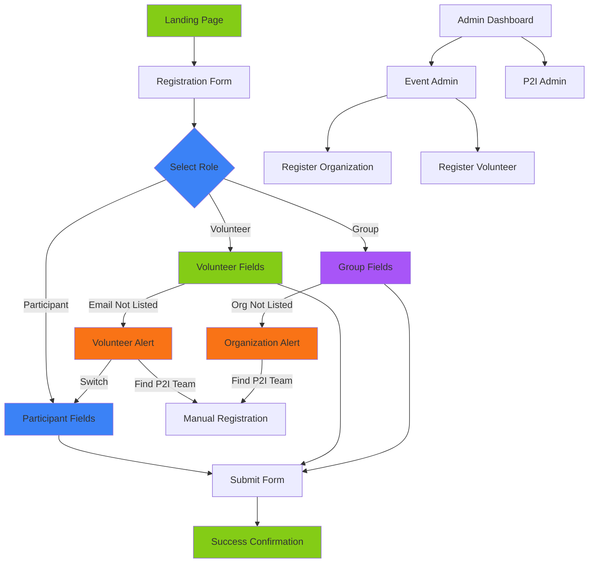

# UI Wireframes V3 - NextJS Web Application

**Version:** 3.0
**Date:** 2026-02-16
**Status:** Current Implementation (NextJS Web App)
**Previous Version:** V2.0 (Flutter Mobile App - Deprecated)

---

## Overview

This version documents the **current NextJS web application** for PowerHouseGames event registration. The application is a simplified web-based form hosted on Vercel with a Neon PostgreSQL database, replacing the previous Flutter mobile app architecture.

### Key Changes from V2
- ✅ **Three registration roles:** Participant, Volunteer, Group (was: Attendee, Volunteer)
- ✅ **Web-based form:** NextJS application instead of Flutter mobile app
- ✅ **Role selection:** Radio buttons on single page (not separate screen)
- ✅ **Dynamic fields:** Conditional fields based on role and organization type
- ✅ **Auto-population:** Contact details pre-fill for Group and Volunteer roles
- ✅ **Alert systems:** Volunteer not listed, Organization not listed
- ✅ **Group-specific fields:** Group size, disabled students, SEN students
- ✅ **Group leader participation:** Tracks if group leader participates in games
- ✅ **Consent split:** Feedback consent and next event consent (separate from marketing)
- ❌ **Phone field removed:** Not collected in V3
- ❌ **Check-in/Check-out:** Not yet implemented (future feature)

---

## User Flow Diagram



---

## Application Structure

### Current Implementation (V3)

The application is a **single-page web form** with dynamic field visibility based on role selection. There are no separate screens for role selection or consents - everything is on one scrollable form.

**URL Structure:**
- Public Form: `/test-form` or `/test-form?role=Participant|Volunteer|Group`
- Admin Dashboard: `/admin` (PIN: 1234 for Event Admin, 9876 for P2I Admin)
- Event Admin: `/admin/event`
- P2I Admin: `/admin/p2i`
- Register Organization: `/admin/event/register-organization`
- Register Volunteer: `/admin/event/register-volunteer`

**Key Features:**
- URL parameter-based role preselection
- Dynamic event loading from database
- Conditional field visibility
- Auto-population of contact details
- Alert systems for "not listed" scenarios
- Two-level admin authentication

---

## Registration Form Wireframes

### Main Registration Form (Single Page)

The registration form is a **single-page scrollable form** with dynamic fields based on role selection. All fields, consents, and submit button are on one page.

```
┌─────────────────────────────────────────────────────────┐
│  PowerHouseGames Registration                           │
│  Leicester 2026 - 15 March 2026                         │
│                                                         │
│  ┌─────────────────────────────────────────────────┐   │
│  │ ROLE SELECTION (Radio Buttons)                  │   │
│  │                                                 │   │
│  │ ○ Participant - I'm playing in the games       │   │
│  │ ○ Volunteer - I'm helping at the event         │   │
│  │ ○ Group - I'm bringing a group                 │   │
│  └─────────────────────────────────────────────────┘   │
│                                                         │
│  ┌─────────────────────────────────────────────────┐   │
│  │ DYNAMIC FIELDS (Based on Role)                  │   │
│  │                                                 │   │
│  │ [Organization/Email fields - side by side]     │   │
│  │ [First Name] [Last Name] - side by side        │   │
│  │                                                 │   │
│  │ [Conditional: Group Leader Participation]      │   │
│  │ [Conditional: Instructional Note]              │   │
│  │                                                 │   │
│  │ Impairment Question: [Dropdown]                │   │
│  │                                                 │   │
│  │ [Conditional: Group Size, Disabled, SEN]       │   │
│  │                                                 │   │
│  │ ☐ Feedback consent (optional)                  │   │
│  │ ☐ Next event consent (optional)                │   │
│  │                                                 │   │
│  │ Photo Consent: ○ Yes ○ No                      │   │
│  │                                                 │   │
│  │ [SUBMIT REGISTRATION]                          │   │
│  └─────────────────────────────────────────────────┘   │
│                                                         │
└─────────────────────────────────────────────────────────┘
```

---

### Participant Role Form

```
┌─────────────────────────────────────────────────────────┐
│  ● Participant ○ Volunteer ○ Group                      │
│                                                         │
│  Your Group Name (optional)    Your email (optional)   │
│  ┌──────────────────────┐     ┌──────────────────────┐ │
│  │ Select or type... ▼  │     │ your.email@...       │ │
│  └──────────────────────┘     └──────────────────────┘ │
│                                                         │
│  Your first name: *            Your last name: *       │
│  ┌──────────────────────┐     ┌──────────────────────┐ │
│  │ Enter first name     │     │ Enter last name      │ │
│  └──────────────────────┘     └──────────────────────┘ │
│                                                         │
│  Do you consider yourself to be a disabled person...   │
│  ┌──────────────────────────────────────────────────┐  │
│  │ Select...                                     ▼  │  │
│  └──────────────────────────────────────────────────┘  │
│                                                         │
│  ☐ I consent to being contacted for post-event feedback│
│  ☐ I would like to receive information about future... │
│                                                         │
│  Photo Consent                                          │
│  ● I consent to photos being taken                     │
│  ○ I do not consent to photos being taken              │
│                                                         │
│  ┌─────────────────────────────────────────────────┐   │
│  │         SUBMIT REGISTRATION                     │   │
│  └─────────────────────────────────────────────────┘   │
│                                                         │
└─────────────────────────────────────────────────────────┘
```

**Key Features:**
- Organization field is optional combobox (can select or type custom)
- Email is optional text input
- Name fields are required
- Impairment dropdown is optional
- Two optional consent checkboxes
- Photo consent radio buttons (required)
- Blue color scheme for participant elements

---

### Volunteer Role Form

```
┌─────────────────────────────────────────────────────────┐
│  ○ Participant ● Volunteer ○ Group                      │
│                                                         │
│  Your first name: *            Your last name: *       │
│  ┌──────────────────────┐     ┌──────────────────────┐ │
│  │ John (auto-filled)   │     │ Smith (auto-filled)  │ │
│  └──────────────────────┘     └──────────────────────┘ │
│                                                         │
│  Your email:                                            │
│  ┌──────────────────────────────────────────────────┐  │
│  │ john.smith@example.com                        ▼  │  │
│  │ jane.doe@example.com                             │  │
│  │ ⚠️ My email isn't listed here!                   │  │
│  └──────────────────────────────────────────────────┘  │
│                                                         │
│  Do you consider yourself to be a disabled person...   │
│  ┌──────────────────────────────────────────────────┐  │
│  │ Select...                                     ▼  │  │
│  └──────────────────────────────────────────────────┘  │
│                                                         │
│  ☐ I consent to being contacted for post-event feedback│
│  ☐ I would like to receive information about future... │
│                                                         │
│  Photo Consent                                          │
│  ● I consent to photos being taken                     │
│  ○ I do not consent to photos being taken              │
│                                                         │
│  ┌─────────────────────────────────────────────────┐   │
│  │         SUBMIT REGISTRATION                     │   │
│  └─────────────────────────────────────────────────┘   │
│                                                         │
└─────────────────────────────────────────────────────────┘
```

**Key Features:**
- Email dropdown with pre-registered volunteers + "not listed" option
- Name fields auto-populate when email is selected (display only)
- Selecting email auto-fills first and last name
- Impairment, consents only visible when valid email selected
- Lime green color scheme for volunteer elements

**Special Behavior - Email Not Listed:**
When volunteer selects "⚠️ My email isn't listed here!", an alert appears:

```
┌─────────────────────────────────────────────────────────┐
│  ┌─────────────────────────────────────────────────┐   │
│  │ 👋 OK - first can we check if you are going to │   │
│  │    join in with the Games as a player?         │   │
│  │                                                 │   │
│  │ ┌─────────────────────────────────────────────┐│   │
│  ││ 🎯 If you are playing in the Games          ││   │
│  ││                                             ││   │
│  ││ [🎯 Switch to Participant Registration]    ││   │
│  │└─────────────────────────────────────────────┘│   │
│  │                                                 │   │
│  │ ┌─────────────────────────────────────────────┐│   │
│  ││ 🙋 If you are not taking part               ││   │
│  ││                                             ││   │
│  ││ Please find a P2I team member to add you   ││   │
│  ││ to the volunteer system                     ││   │
│  │└─────────────────────────────────────────────┘│   │
│  └─────────────────────────────────────────────────┘   │
└─────────────────────────────────────────────────────────┘
```

---

### Group Role Form

```
┌─────────────────────────────────────────────────────────┐
│  ○ Participant ○ Volunteer ● Group                      │
│                                                         │
│  Your Organisation or Group Name: *                     │
│  ┌──────────────────────────────────────────────────┐  │
│  │ Glenfield SEN School                          ▼  │  │
│  │ Next PLC                                         │  │
│  │ Family Group                                     │  │
│  │ ⚠️ My organisation isn't listed here!            │  │
│  └──────────────────────────────────────────────────┘  │
│                                                         │
│  Your email (optional)                                  │
│  ┌──────────────────────────────────────────────────┐  │
│  │ contact@glenfield.sch.uk (auto-filled)           │  │
│  └──────────────────────────────────────────────────┘  │
│                                                         │
│  Your first name: *            Your last name: *       │
│  ┌──────────────────────┐     ┌──────────────────────┐ │
│  │ Sarah (auto-filled)  │     │ Johnson (auto-filled)│ │
│  └──────────────────────┘     └──────────────────────┘ │
│                                                         │
│  ℹ️ Please check your details are correct - sometimes  │
│     other staff attend on behalf of the original...    │
│                                                         │
│  Will you be participating in the games?                │
│  ● I will be joining in the games as a participant     │
│  ○ I will not be taking part in the games              │
│                                                         │
│  Do you consider yourself to be a disabled person...   │
│  ┌──────────────────────────────────────────────────┐  │
│  │ Select...                                     ▼  │  │
│  └──────────────────────────────────────────────────┘  │
│                                                         │
│  How many participants are you responsible for? *       │
│  ┌──────────────────────────────────────────────────┐  │
│  │ e.g., 25                                         │  │
│  └──────────────────────────────────────────────────┘  │
│                                                         │
│  How many of your participants are disabled people? *  │
│  ┌──────────────────────────────────────────────────┐  │
│  │ e.g., 5                                          │  │
│  └──────────────────────────────────────────────────┘  │
│                                                         │
│  How many of your participants have SEN? *              │
│  ┌──────────────────────────────────────────────────┐  │
│  │ e.g., 3                                          │  │
│  └──────────────────────────────────────────────────┘  │
│                                                         │
│  ☐ I consent to being contacted for post-event feedback│
│  ☐ I would like to receive information about future... │
│                                                         │
│  Photo Consent                                          │
│  ● I consent to photos being taken                     │
│  ○ I do not consent to photos being taken              │
│                                                         │
│  ┌─────────────────────────────────────────────────┐   │
│  │         SUBMIT REGISTRATION                     │   │
│  └─────────────────────────────────────────────────┘   │
│                                                         │
└─────────────────────────────────────────────────────────┘
```

**Key Features:**
- Organization dropdown (required)
- Email, first name, last name auto-populate from organization contact details
- Instructional note appears for disability organizations (not Family Group)
- Group leader participation radio buttons (required)
- Group-specific fields (size, disabled, SEN) only for disability/family groups
- Purple color scheme for group elements

**Special Behavior - Organization Not Listed:**
When group leader selects "⚠️ My organisation isn't listed here!", an alert appears:

```
┌─────────────────────────────────────────────────────────┐
│  ┌─────────────────────────────────────────────────┐   │
│  │ 🏢 Your organisation isn't currently registered │   │
│  │    for this event                               │   │
│  │                                                 │   │
│  │ Please speak to a P2I team member to add your  │   │
│  │ organisation to the system. Look for staff     │   │
│  │ wearing a P2I badge.                           │   │
│  └─────────────────────────────────────────────────┘   │
└─────────────────────────────────────────────────────────┘
```

---

### Success Confirmation Screen

```
┌─────────────────────────────────────────────────────────┐
│         ✅ Registration Successful!                     │
│                                                         │
│  ┌─────────────────────────────────────────────────┐   │
│  │                                                 │   │
│  │         ✓                                       │   │
│  │                                                 │   │
│  │   Thank you for registering!                   │   │
│  │                                                 │   │
│  │   Name: John Smith                             │   │
│  │   Role: Participant                            │   │
│  │   Event: PowerHouseGames Leicester 2026        │   │
│  │                                                 │   │
│  │   See you at the event!                        │   │
│  │                                                 │   │
│  └─────────────────────────────────────────────────┘   │
│                                                         │
│  ┌─────────────────────────────────────────────────┐   │
│  │         REGISTER ANOTHER PERSON                 │   │
│  └─────────────────────────────────────────────────┘   │
│                                                         │
└─────────────────────────────────────────────────────────┘
```

**Elements:**
- Success icon (large checkmark)
- Confirmation message
- Summary of registration (name, role, event)
- Button to register another person

**Actions:**
- Click "REGISTER ANOTHER PERSON" → Reload form with blank fields
- Form automatically resets after 10 seconds

---

## Design Principles

### Web Application Design
- **Responsive layout** - Works on desktop, tablet, and mobile
- **Single-page form** - All fields on one scrollable page
- **Progressive disclosure** - Fields appear/hide based on role selection
- **Clear visual hierarchy** - Role selection → Fields → Consents → Submit
- **Immediate feedback** - Validation errors shown inline

### Accessibility
- **WCAG AA compliance** - Minimum contrast ratio 4.5:1
- **Keyboard navigation** - Full keyboard support for all interactions
- **Screen reader support** - All elements properly labeled with ARIA attributes
- **Focus indicators** - Clear visual focus states
- **Error messages** - Clear, descriptive validation messages

### Color Coding System
- **Blue (#3b82f6)** - Participant role elements and informational notes
- **Lime Green (#84cc16)** - Volunteer role elements and buttons
- **Purple (#a855f7)** - Group role elements and buttons
- **Orange (#f97316)** - Alerts, warnings, and admin functions

### Form UX Patterns
- **Auto-population** - Contact details pre-fill when available
- **Conditional fields** - Dynamic visibility based on role and organization
- **Side-by-side layout** - Related fields paired horizontally on larger screens
- **Alert systems** - Clear guidance when data not found
- **Validation on submit** - All validation happens when user clicks submit

---

## Field Specifications

For complete field specifications by role, see **[REGISTRATION_FORM_FIELDS.md](./REGISTRATION_FORM_FIELDS.md)**.

### Common Fields (All Roles)

**First Name**
- Type: Text input
- Required: Yes
- Validation: 2-100 characters, letters/spaces/hyphens/apostrophes only
- Auto-population: Yes (Volunteer and Group roles)

**Last Name**
- Type: Text input
- Required: Yes
- Validation: 2-100 characters, letters/spaces/hyphens/apostrophes only
- Auto-population: Yes (Volunteer and Group roles)

**Impairment Question**
- Type: Dropdown select
- Label: "Do you consider yourself to be a disabled person, or to have a long-term physical or mental health condition or impairment?"
- Options: "Yes", "No", "Rather not say"
- Required: No
- Layout: Label left, dropdown right

**Photo Consent**
- Type: Radio buttons
- Options: "I consent to photos being taken" / "I do not consent to photos being taken"
- Required: Yes
- Default: Consent given (true)

**Feedback Consent**
- Type: Checkbox
- Label: "I consent to being contacted for post-event feedback"
- Required: No
- Default: Unchecked

**Next Event Consent**
- Type: Checkbox
- Label: "I would like to receive information about future PowerHouseGames events"
- Required: No
- Default: Unchecked

---

### Role-Specific Fields

**Participant Role:**
- Organization (optional combobox - select or type custom)
- Email (optional text input)

**Volunteer Role:**
- Email (required dropdown - pre-registered volunteers + "not listed")
- Name fields auto-populate when email selected (display only)

**Group Role:**
- Organization (required dropdown - registered organizations + "not listed")
- Email (optional, auto-populated from organization contact)
- Group Leader Participation (required radio buttons)
- Group Size (required for disability/family groups)
- Disabled Students (required for disability/family groups)
- SEN Students (required for disability/family groups)

---

### Conditional Visibility Rules

**Volunteer Role - Fields Hidden When "Not Listed":**
- Impairment dropdown
- Feedback consent checkbox
- Next event consent checkbox

**Group Role - Fields Only for Disability/Family Groups:**
- Group Size number input
- Disabled Students number input
- SEN Students number input

**Group Role - Instructional Note:**
- Only shown for disability organizations (not Family Group)
- Blue informational text below name fields

---

## Summary

### Current Implementation (V3.0)

**Application Type:** NextJS 16.1.6 web application hosted on Vercel

**Database:** Neon PostgreSQL (serverless, EU West London)

**Form Structure:**
- Single-page scrollable form
- Dynamic field visibility based on role selection
- Three registration roles: Participant, Volunteer, Group
- URL parameter support for role preselection

**Required Fields by Role:**
- **Participant:** First Name, Last Name, Photo Consent (3 fields)
- **Volunteer:** Email, First Name, Last Name, Photo Consent (4 fields)
- **Group:** Organization, First Name, Last Name, Group Leader Participation, Photo Consent (5 fields)
- **Group (Disability/Family):** + Group Size, Disabled Students, SEN Students (8 fields total)

**Optional Fields:**
- Organization (Participant only)
- Email (Participant and Group)
- Impairment dropdown (all roles)
- Feedback consent (all roles)
- Next event consent (all roles)

**Special Features:**
- Auto-population of contact details (Volunteer and Group roles)
- Alert systems for "not listed" scenarios
- Conditional field visibility based on organization type
- Two-level admin authentication (Event Admin PIN: 1234, P2I Admin PIN: 9876)

**Admin Features:**
- Register organizations for events
- Register volunteers for events
- View registrations (future feature)
- Export data (future feature)

---

## Next Steps

### Completed ✅
1. ✅ **Wireframes updated to V3.0** - Reflects current NextJS implementation
2. ✅ **Three registration roles defined** - Participant, Volunteer, Group
3. ✅ **Conditional fields implemented** - Role-specific and organization-specific
4. ✅ **Data models updated** - V2.0 aligned with current implementation
5. ✅ **Field specifications documented** - REGISTRATION_FORM_FIELDS.md created

### Future Enhancements ⏳
1. ⏳ **Check-in/Check-out system** - Track attendance at event
2. ⏳ **View registrations page** - Admin dashboard to view all registrations
3. ⏳ **Export to CSV** - Download registration data
4. ⏳ **Sync to Airtable** - Post-event data synchronization
5. ⏳ **Email confirmations** - Send confirmation emails to registrants
6. ⏳ **QR code check-in** - Faster check-in process at event

---

## Document History

| Version | Date | Changes | Status |
|---------|------|---------|--------|
| 1.0 | 2026-02-06 | Initial wireframes for Flutter mobile app | Deprecated |
| 2.0 | 2026-02-11 | Updated based on Airtable form feedback | Deprecated |
| 3.0 | 2026-02-16 | Complete rewrite for NextJS web application | Current |

---

*Document Version: 3.0*
*Last Updated: 2026-02-16*
*Status: Current Implementation (NextJS Web App)*
*Reference: REGISTRATION_FORM_FIELDS.md, DATA_MODELS.md V2.0*

